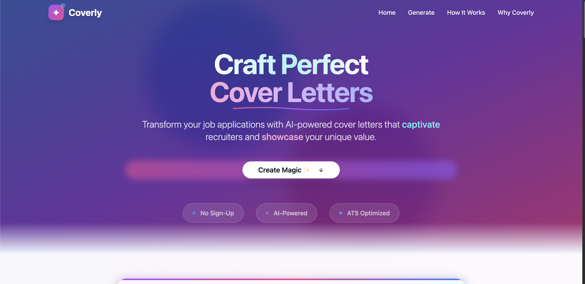

# Coverly - AI-Powered Cover Letter Generator

> Transform your job applications with intelligent, personalized cover letters that get you hired faster.



## 🚀 Features

- **🤖 AI-Powered Personalization**: Advanced AI analyzes your CV and creates tailored cover letters
- **📄 Smart PDF Processing**: Automatically extracts text from your resume with multiple extraction methods
- **🎯 Job-Specific Matching**: Matches your experience to job requirements intelligently
- **🔄 Instant Regeneration**: Create multiple versions with different approaches and emphasis
- **⚡ Real-Time Generation**: Generate professional cover letters in under 30 seconds
- **📱 Responsive Design**: Works seamlessly on desktop, tablet, and mobile devices
- **🎨 Multiple Tones**: Choose from professional, conversational, confident, or humble tones
- **📏 Flexible Length**: Generate concise, standard, or detailed cover letters
- **🏭 Industry-Specific**: Tailored approaches for tech, finance, healthcare, and more
- **✨ ATS-Optimized**: Optimized for Applicant Tracking Systems

## 🛠️ Tech Stack

- **Frontend**: React 18, TypeScript, Vite
- **Styling**: Tailwind CSS, Radix UI Components
- **Backend**: Supabase Edge Functions
- **AI Integration**: OpenAI GPT-4o-mini
- **PDF Processing**: Advanced text extraction with fallback methods
- **State Management**: React Query (TanStack Query)
- **Routing**: React Router DOM
- **Form Handling**: React Hook Form with Zod validation

## 🏗️ Architecture

```
┌─────────────────┐    ┌──────────────────┐    ┌─────────────────┐
│   React SPA     │    │  Supabase Edge   │    │   OpenAI API    │
│   (Frontend)    │◄──►│   Functions      │◄──►│                 │
│                 │    │   (Backend)      │    │                 │
└─────────────────┘    └──────────────────┘    └─────────────────┘
         │                        │
         │                        ▼
         ▼                ┌──────────────────┐
┌─────────────────┐       │ PDF Text         │
│ Component Tree  │       │ Extraction       │
│                 │       │                  │
│ ├── Navigation  │       └──────────────────┘
│ ├── Hero        │
│ ├── Form        │
│ ├── HowItWorks  │
│ ├── WhyUseThis  │
│ └── Footer      │
└─────────────────┘
```

## 🚦 Getting Started

### Prerequisites

- Node.js 18+ and npm
- Supabase account (for backend functions)
- OpenAI API key

### Installation

1. **Clone the repository**
   ```bash
   git clone https://github.com/husseintantawy/instant-letter-forge.git
   cd instant-letter-forge
   ```

2. **Install dependencies**
   ```bash
   npm install
   ```

3. **Set up environment variables**
   ```bash
   # Create .env.local file
   VITE_SUPABASE_URL=your_supabase_url
   VITE_SUPABASE_ANON_KEY=your_supabase_anon_key
   ```

4. **Start development server**
   ```bash
   npm run dev
   ```

5. **Set up Supabase Edge Function**
   ```bash
   # Deploy the cover letter generation function
   supabase functions deploy generate-cover-letter --no-verify-jwt
   ```

## 🏃‍♂️ Usage

1. **Upload Your CV**: Drag and drop your PDF resume
2. **Enter Job Details**: Provide job title, company, and job description
3. **Customize Settings**: Choose tone, length, industry, and focus areas
4. **Generate**: Click to create your personalized cover letter
5. **Edit & Regenerate**: Fine-tune or generate alternative versions
6. **Export**: Copy to clipboard or download as text file

## 📂 Project Structure

```
src/
├── components/           # React components
│   ├── ui/              # Reusable UI components
│   ├── Hero.tsx         # Landing section
│   ├── Navigation.tsx   # Header navigation
│   ├── CoverLetterOutput.tsx  # Results display
│   └── ...
├── pages/               # Page components
│   └── Index.tsx        # Main application page
├── hooks/               # Custom React hooks
├── integrations/        # External service integrations
│   └── supabase/        # Supabase client setup
└── styles/              # Global styles

supabase/
└── functions/
    └── generate-cover-letter/  # AI processing function
        └── index.ts
```

## 🔧 Configuration

### Supabase Setup

1. Create a new Supabase project
2. Set up environment variables for OpenAI API key
3. Deploy the edge function for cover letter generation

### OpenAI Integration

The application uses OpenAI's GPT-4o-mini model for:
- PDF text extraction (via Vision API)
- Personalized cover letter generation
- Content analysis and optimization

## 🎯 Key Features Breakdown

### Intelligent PDF Processing
- **Primary Method**: OpenAI Vision API for accurate text extraction
- **Fallback Method**: Direct PDF parsing for simple documents
- **Error Handling**: Graceful degradation with user guidance

### AI Personalization Engine
- **CV Analysis**: Extracts job titles, companies, skills, achievements
- **Job Matching**: Connects past experience to job requirements
- **Content Generation**: Creates tailored content with specific examples

### User Experience
- **Smooth Scrolling Navigation**: Easy section navigation
- **Real-time Validation**: Instant feedback on form inputs
- **Progressive Enhancement**: Works with or without successful PDF extraction

## 🧪 Testing & Quality

- TypeScript for type safety
- ESLint for code quality
- Responsive design testing across devices
- PDF extraction testing with various document formats

## 🚀 Deployment

### Build for Production
```bash
npm run build
```

### Deploy to Vercel/Netlify
The application is optimized for deployment on modern hosting platforms:

1. Connect your GitHub repository
2. Set environment variables
3. Deploy automatically on push to main branch

## 🤝 Contributing

1. Fork the repository
2. Create a feature branch (`git checkout -b feature/amazing-feature`)
3. Commit your changes (`git commit -m 'Add amazing feature'`)
4. Push to the branch (`git push origin feature/amazing-feature`)
5. Open a Pull Request

## 📄 License

This project is licensed under the MIT License - see the [LICENSE](LICENSE) file for details.

## 👨‍💻 Author

**Hussein Tantawy**
- GitHub: [@husseintantawy](https://github.com/HTantawy)
- Portfolio: [husseintantawy.dev](https://husseins-portfolio-website.vercel.app/)

## 🙏 Acknowledgments

- OpenAI for providing powerful AI capabilities
- Supabase for excellent backend-as-a-service platform
- Radix UI for accessible component primitives
- Tailwind CSS for utility-first styling

---

⭐ **Star this repository if it helped you land your dream job!** ⭐